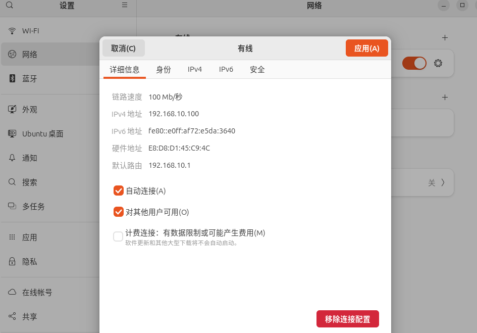

# arm 系统环境配置
## images 获取
安装 docker engine


## container 创建

还是用命令行。冲。
```
services:
  app:
    image: ubuntu:16.04
    command: "/bin/bash"
    volumes:
      - ./:/swap
    environment:
      - PATH=/usr/local/sbin:/usr/local/bin:/usr/sbin:/usr/bin:/sbin:/bin
    cap_add:
      - ALL
    container_name: embeed 
    tty: true
    privileged: true
volumes:
  arm-data:
```

此时 直接使用 docker 命令行
```
docker compose up -d #-d 表示后台运行
```

进入container 后, 寻找替代vi 的方式修改 etc/apt/source.list
```
apt-get install vim
apt-get install kmod
apt-get install minicom
apt-get install iputils-ping
apt-get install net-tools
apt-get install make
# NFS 服务
apt-get install nfs-kernel-server rpcbind（每装好）
##ssh
apt-get install openssh-server
#xz 文件解压
apt-get install xz-utils

```

当前目录与容器内的 /swap 目录是可以进行文件传输的。至此，进行开发的系统环境配置完毕。

- [] docker中使用 nfs 提示 加密 [nfs配置问题](https://forum.ubuntu.org.cn/viewtopic.php?p=840692)

# 开发环境

## 交叉编译器
仅仅列举部分有意思的指令
```
echo "export PATH=\$PATH:$(pwd)" >> /etc/profile #这样就是标准的
echo "export PATH=$PATH:$(pwd)" >> /etc/profile #这样会把PATH变量解析出来
echo "export PATH=$PATH:$pwd" >> /etc/profile #pwd 是命令，不是变量，所以为空

#相关库
apt-get install lsb-core lib32stdc++6

# verify
arm-linux-gnueabihf-gcc -v

```

## 开发板的内核移植
### U-BOOT 移植
1. 设备校验
   读卡器使用adapter + SD卡 才能读到 /dev/sda1
   imxdownload 可以用
    电脑的第二个USB口能用
    开发版的SD卡 启动方式不能用

    分不清楚 /dev/ 里面的内容，使用fdisk 。一看就明白了
    ```
    fdisk -l /dev/sda
    ```
    isk /dev/sda：29.12 GiB，31266439168 字节，61067264 个扇区
    Disk model: Storage Device  
    单元：扇区 / 1 * 512 = 512 字节
    扇区大小(逻辑/物理)：512 字节 / 512 字节
    I/O 大小(最小/最佳)：512 字节 / 512 字节
    磁盘标签类型：dos
    磁盘标识符：0xa4657860

    设备       启动 起点     末尾     扇区  大小 Id 类型
    /dev/sda1         32 61067263 61067232 29.1G  c W95 FAT32 (LBA)
2. 网络连接
  2.1 物理准备
    网线插上。
    
    ```
    setenv ipaddr 192.168.10.110
    setenv ethaddr b8:ae:1d:01:00:00
    setenv gatewayip 192.168.10.1
    setenv netmask 255.255.255.0
    setenv serverip 192.168.10.100
    saveenv
    
    ping 192.168.10.100
    ```
    

### linux 内核移植
### 根文件系统移植